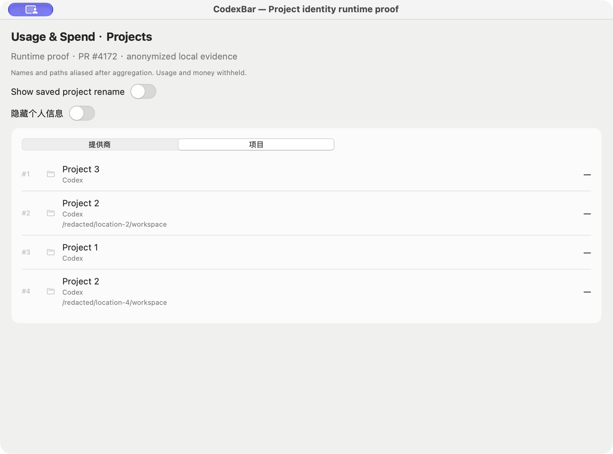
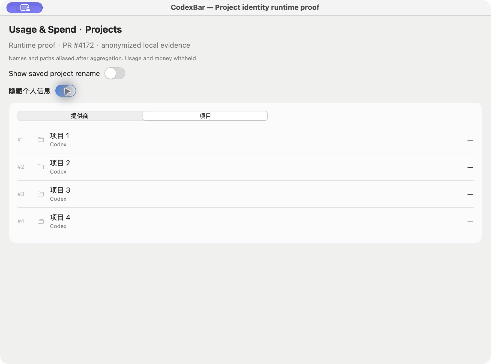
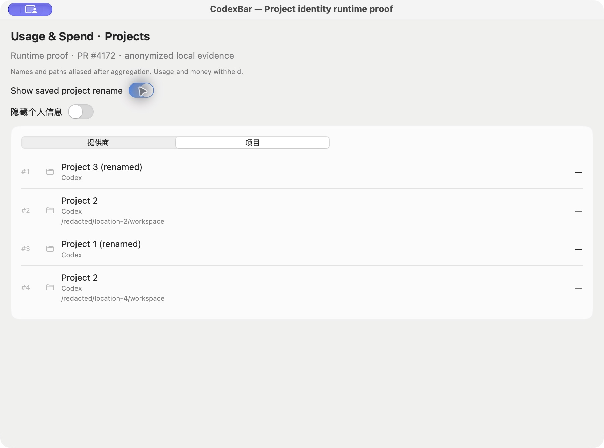

# PR #4172: anonymized native runtime evidence

PR head: `f5fcf05d6e78972c2b17409fec63b047a0fc44c2`.

This evidence is derived from the existing local runtime verification, with privacy transformations applied **after** the production scanner and project aggregation. It preserves the observed row structure and identity relationships. It is not an unmodified original capture, and does not disclose personal names, directory structure, session contents, usage, or money.

## Observed behavior

- Two rows share the alias **Project 2** but retain distinct aliased paths. Production aggregation kept the underlying projects separate.
- Saved project names were resolved before aliases were assigned; the machine-readable receipt records that check. Actual names and the private alias mapping are intentionally withheld.
- The native privacy switch hides the aliases and paths, including accessibility help. Switching it off restores the original anonymized presentation.

## Additional saved-name rename verification

The same fresh executable loads the original isolated proof home, then updates only the copied proof metadata to a generic verification label and reloads the **same** home through production `CostUsageFetcher`. The copied metadata is restored on completion. Live project metadata is never modified, and session inputs are unchanged.

Before redaction, every production project row is compared by its real stable ID. The assertions require the complete ID set, token values, and optional cost values to be identical across the reload, and require all changed saved names to match the generic verification label. Both scans must establish complete coverage. The public receipt publishes only pass/fail values, not real identities or metrics.

The native comparison switch shows the before and after snapshots, both already computed through production code. Changed names are presented as the original generic alias plus `(renamed)`; this is an explicit privacy projection, not the literal saved name. The screenshot establishes the resulting panel presentation, while the included source and receipt establish the lookup and equality checks.

This is a metadata reload/rename check within one isolated proof process, not a full restart of normal application preferences.

## What was redacted

Project labels use consistent generic aliases. Every directory is replaced by an unrelated `/redacted/location-N/workspace` alias, retaining only the distinctions needed for the regression. All token and cost values are withheld (`null` in the receipt, dashes in the UI). Raw rollouts, database files, source filenames, session IDs, file sizes, account details, original identifiers, and the alias mapping are not included.

The screenshots were captured directly from a separate native proof window after these transformations. They were not generated or retouched. The accompanying accessibility text was captured from that same window.

## Provenance and scope

The production `CostUsageFetcher` and `SpendDashboardModel.build` processed local read-only copies of the previously selected real history and saved project metadata with a separate cache. The scanner reported complete coverage of that selected scope; this is not a full-account claim. No provider startup, pricing refresh, auth-file copying, or installed-application replacement was performed.

An opt-in debug launcher wraps the unchanged production `SpendDashboardDetailPanel` and `SpendProjectRows`. Only the output projection used for public presentation is anonymized. This is isolated native panel verification, not a normal-launch account/preferences probe. The launcher and hook patch are provided for inspection and are not in the production PR. A fresh debug executable was built and its separate proof bundle passed ad-hoc signature verification.

`runtime-receipt.json`, `verification.json`, and the initial/private/restored accessibility captures document the checks. Because metrics are withheld, these public screenshots do not prove numeric accounting equality; the before/after equality checks are instead recorded as booleans in the runtime receipt, alongside the regression tests.

For reproduction, check out the referenced head, apply `launch-hook.patch`, and copy `SpendProjectNativeProof.swift` into `Sources/CodexBar`. Use an expendable private isolated proof root with copies of your own history/metadata and configure its path through the proof bundle's `CodexBarProjectProofRoot` key. Keep raw inputs and mappings local. Wait for complete scan coverage before capturing.

This replacement supersedes the withdrawn unredacted evidence. Only this independent anonymized commit should be linked publicly.
